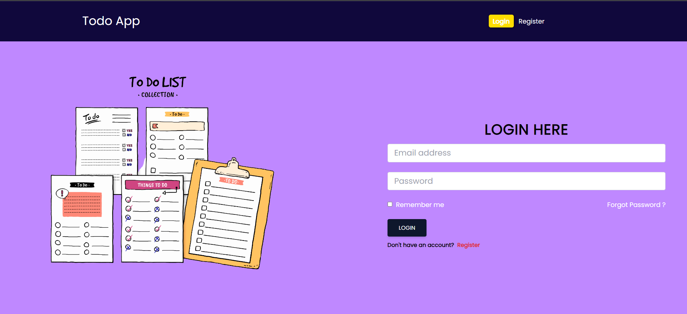
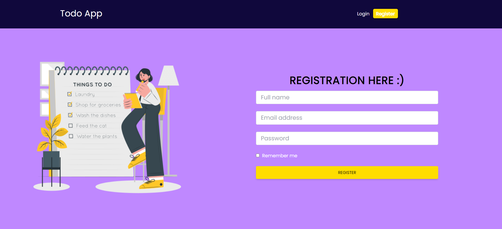
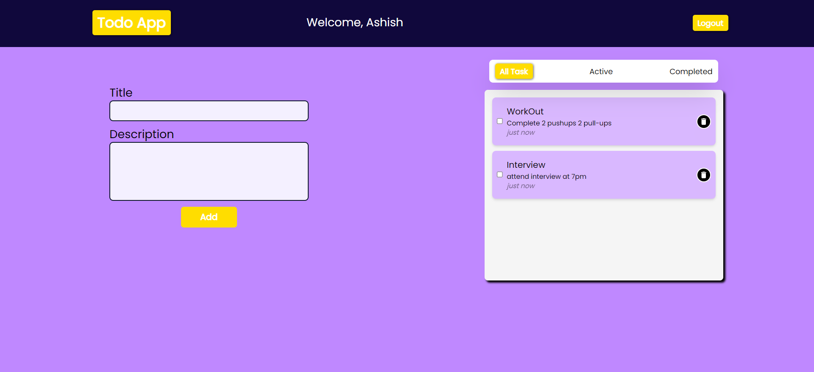

# Competishun Todo Assignment

This is a simple project that includes both a backend and a frontend for managing tasks. The backend is built with Node.js and MongoDB, while the frontend is a React application.

Screenshots





## Prerequisites

Before you begin, ensure you have the following prerequisites installed on your system:

- Node.js: Download and install it from [nodejs.org](https://nodejs.org/).
- MongoDB: You can install MongoDB locally or use a cloud-hosted MongoDB instance.

## Getting Started

Follow these steps to get the project up and running on your system:

1. Clone the repository:

   ```bash
   git clone https://github.com/pranshavv/competishun-todo-assignment.git

2. Navigate to the backend directory and create a .env file with the following content, replacing the values with your own:

```
MONGO_URI=Your MongoDB URI
GMAIL_USERNAME=your gmail address 
GMAIL_PASSWORD=password created inside the 'App Password' section under the Google Accounts setting
PORT=8000
JWT_SECRET=a random secret key eg. thisisasecretkey
```

Setting Up MongoDB Database
To set up a MongoDB database for this project, follow these steps:

Sign in to your MongoDB account or create a new one on the MongoDB Atlas website.

Create a new cluster and configure it according to your needs. Make note of the MongoDB connection URI provided by MongoDB Atlas.

Open the ```.env``` file in the backend directory and replace the MONGO_URI value with the MongoDB connection URI from step 2.

```MONGO_URI='your-mongodb-connection-uri'```
Save the ```.env``` file.

3. Install backend dependencies and start the server:

```
cd backend
npm install
nodemon server
```

4. Open a new terminal window, navigate to the frontend directory, and install frontend dependencies:
```
cd frontend
npm install
```
5. Start the React app:
```npm start```

Usage
Once the application is running, you can create, update, and delete tasks using the user-friendly interface.
Users can sign up and log in to manage their tasks.
Tasks are stored in the MongoDB database.

